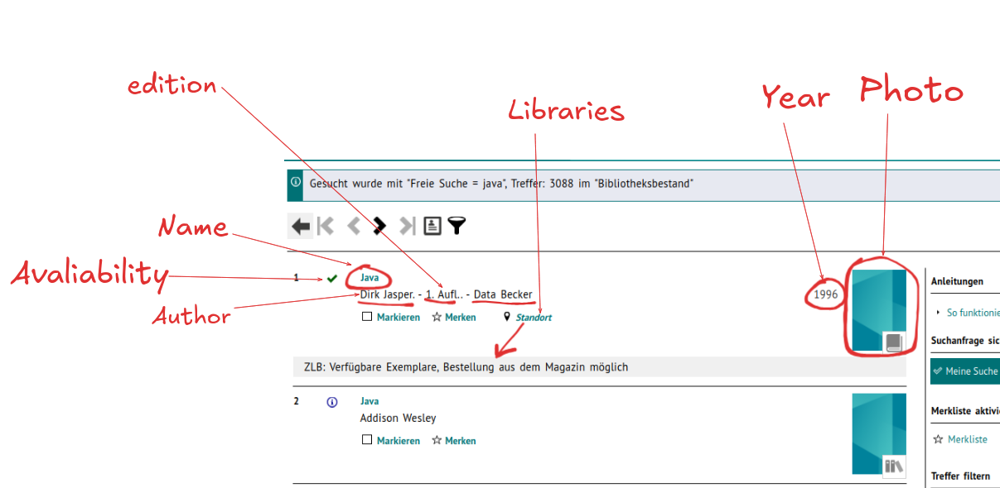
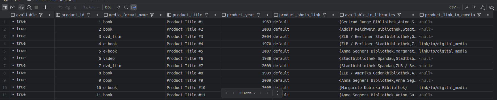

# DB Design for VOEBB

This database management system designed to partially simulate the functionality of
the [Verbund der Öffentlichen Bibliotheken Berlins (VÖBB)](https://www.voebb.de/aDISWeb/app?service=direct/0/Home/$DirectLink&sp=SPROD00).
It focuses exclusively on PostgreSQL, featuring a normalized schema, advanced SQL queries, and functionality to
handle library collections, reservations, borrowing processes, and detailed statistical reporting.

### Table of Contents

- [Features](#Features)
- [Database Schema](#database-schema)
- [Views and Utilities](#views-and-utilities)
- [Setup Instructions](#setup-instructions)
- [Interesting SQL Queries](#sql-queries)

### Features

#### Database Design

- **Normalized schema** with relationships, constraints, and foreign keys
- Advanced use of PostgreSQL features: Partial indexes, GIN indexes, extensions [
  pg_trgm](https://www.alibabacloud.com/help/en/analyticdb/analyticdb-for-postgresql/user-guide/pg-trgm), [pg_cron](https://tembo.io/docs/getting-started/postgres_guides/extensions/pg_cron),
  views,
  and aggregate functions.

#### Core Functionalities

- Borrowing and returning:
    - Borrow items with automatic borrow_due_date calculation based on media_format.
    - Return items and update availability status.
    - Show borrowed history for each client.
- Reservations:
    - Reserve items for up to 3 days.
    - Cancel reservations manually or automatically when expired (via a scheduled cron job [extension
      ```pg_cron```](https://www.databasetour.net/documentation/managing-cron-jobs-in-postgresql-db.htm)).
- Statistics:
    - Detailed insights into library inventory, media format distribution, and item availability.
- Search:
    - Flexible and advanced search functionality, including full-text search across multiple tables.

#### Database Schema

Refer to the full schema in [ERD - dbdiagram.io](https://dbdiagram.io/d/VOEBB-67878fea6b7fa355c3f37e85).

The schema includes **23 tables** to manage library operations efficiently. Key tables:

- ```product```, ```media_format```, ```book```, ```video``` for cataloging items.
- ```product_item```, ```item_location```, ```item_status``` to manage item availability and location.
- ```borrow```, ```reservation``` to track client interactions.
- ```creator```, ```language```, ```country``` with their relations to track metadata.
  It enforces data consistency through foreign keys, constraints, and triggers.

### Views and Utilities

#### Views

1. ```full_item_info``` - provides detailed information about item location, statuses, and associated libraries,
   including their addresses.

2. ```main_page_info``` - aggregates product data to determine lists of libraries where an item is
   available. 

   <details> <summary>VOEBB Screenshot</summary> <p align="center">  </p> </details>

   <details> <summary>main-page-info</summary> <p align="center">  </p> </details>

#### Utility Function

1. ```validate_item_status()``` - verifies that an item is not already reserved or borrowed.
2. ```calculate_borrow_due_date()``` - automatically calculates borrowing due dates based on media format.
3. ```search_across_multiple_tables()``` - full-text search function across titles, creators, and notes.

#### Indexes

1. GIN Index
    - ```idx_gin_product_search``` - optimizes queries on full-search and similarity on product title, notes.
    - ```idx_gin_creator_search``` - optimizes queries on full-search on creator names.
2. PARTIAL Index
    - ```idx_product_link_to_emedia_not_null``` - optimizes queries on digital items (product_link_to_emedia).


### Setup Instructions

<details> 
  <summary>Click to see</summary>

1.  **Clone the Repository**
    
    ```java
     git clone git@github.com:nat-laz/voebb_library_management_system.git
     cd voebb_library_management_system
    ```

2. **Create database:**
  
   Start ```psql``` and create the database:

    ```sql
    CREATE DATABASE <your-db-name>;
    ```

2. Run schema script:

    ```
    psql -d <your-database-name> -f </absolute/path/to/voebb_library_management_system/>initialization/initial_service_data.sql
    ```

3. Populate tables with sample data:

    ```
    psql -d <your-database-name> -f </absolute/path/to/voebb_library_management_system/>initialization/setup_jobs.sql
    ```
    
    ```
    psql -d <your-database-name> -f </absolute/path/to/voebb_library_management_system/>initialization/cancel_expired_reservation_script.sql
    ```
    
    ```
    psql -d <your-database-name> -f </absolute/path/to/voebb_library_management_system/>initialization/cancel_expired_reservation_script.sql
    ```
    
    ```
    psql -d <your-database-name> -f </absolute/path/to/voebb_library_management_system/>initialization/cancel_expired_reservation_script.sql
    ```
    
    ```
    psql -d <your-database-name> -f </absolute/path/to/voebb_library_management_system/>initialization/generate_random_data.sql
    ```
    Alternatively, connect your database using IntelliJ's Datasource tool and run the scripts in the following [execution order](/src/resources/sql/initialization/execution_order.md).

</details>


### Interesting SQL Queries

Search product by different criteria (e.g title, creator name, language, range between years)

Thanks to `View` our search queries can be really simple, for example:

<details> 
  <summary>Search product by title</summary>

```sql
SELECT *
FROM main_page_info
WHERE product_title ILIKE '%' || ? || '%'
LIMIT 22;
```

</details>

<details> 
  <summary>List products by creator</summary>

```sql
SELECT avaliable,
       media_format_name,
       product_title,
       CONCAT(creator.creator_forename || ' ' || creator.creator_lastname) AS creator_full_name,
       product_year,
       product_photo_link,
       available_in_libraries
FROM main_page_info
         LEFT JOIN creator_relation ON creator_relation.product_id = main_page_info.product_id
         LEFT JOIN creator ON creator.creator_id = creator_relation.creator_id
         LEFT JOIN creator_role ON creator.creator_id = creator_role.role_id
WHERE creator_forename ILIKE '%' || ? || '%'
   OR creator_lastname ILIKE '%' || ? || '%'
LIMIT 22 OFFSET 0;
```

</details>

<details> 
    <summary>Full-text search product across multiple tables</summary>
    
 ```sql
CREATE OR REPLACE FUNCTION search_across_multiple_tables(search_term TEXT)
RETURNS TABLE
            (
                title                  TEXT,
                creator_forename       TEXT,
                creator_lastname       TEXT,
                avaliable              BOOLEAN,
                format                 TEXT,
                year                   SMALLINT,
                product_link_to_emedia TEXT,
                available_in_libraries TEXT,
                description            TEXT
            )
    AS
$$
BEGIN
        RETURN QUERY
            SELECT mpi.product_title                                 AS title,
                   c.creator_forename,
                   c.creator_lastname,
                   mpi.avaliable,
                   mpi.media_format_name                             AS format,
                   mpi.product_year                                  AS year,
                   p.product_link_to_emedia,
                   ARRAY_TO_STRING(mpi.available_in_libraries, ', ') AS available_in_libraries,
                   p.product_note                                    AS description
            FROM main_page_info mpi
                     LEFT JOIN creator_relation cr ON cr.product_id = mpi.product_id
                     LEFT JOIN creator c ON c.creator_id = cr.creator_id
                     LEFT JOIN product p ON cr.product_id = p.product_id
            WHERE mpi.product_title % search_term
               OR p.product_note % search_term
               OR c.creator_forename % search_term
               OR c.creator_lastname % search_term
               OR mpi.product_title ILIKE '%' || search_term || '%'
               OR p.product_note ILIKE '%' || search_term || '%'
               OR c.creator_forename ILIKE '%' || search_term || '%'
               OR c.creator_lastname ILIKE '%' || search_term || '%'
            ORDER BY GREATEST(
                    similarity(LOWER(mpi.product_title), LOWER(search_term)),
                    similarity(LOWER(p.product_note), LOWER(search_term)),
                    similarity(LOWER(c.creator_forename), LOWER(search_term)),
                    similarity(LOWER(c.creator_lastname), LOWER(search_term))
                     ) DESC
            LIMIT 100;
    END;
    $$ LANGUAGE plpgsql;
    
    
    -- TEST QUERY
    SELECT *
    FROM search_across_multiple_tables(:search_term);
    
```
</details>

<details> 
  <summary> Get the availability status and library location details for a specific product</summary>

```sql
SELECT DISTINCT fii.item_status_name,
                fii.product_title                                   AS title,
                CONCAT(c.creator_forename, ' ', c.creator_lastname) AS creator_full_name,
                fii.library_name,
                fii.city,
                fii.street,
                fii.house_number,
                la.osm_link,
                fii.item_id
FROM full_item_info fii
         LEFT JOIN creator_relation cr ON cr.product_id = fii.product_id
         LEFT JOIN creator c ON c.creator_id = cr.creator_id
         LEFT JOIN library_address la ON la.library_id = fii.library_id
WHERE fii.product_id = ?;

```

### Project Developer Team

- [Alex Bruch](https://github.com/bruch-alex)
- [Natalie Lazarev](https://github.com/nat-laz)